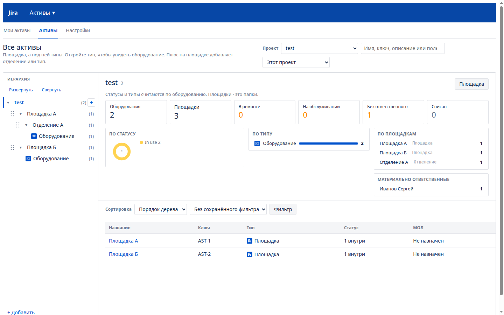
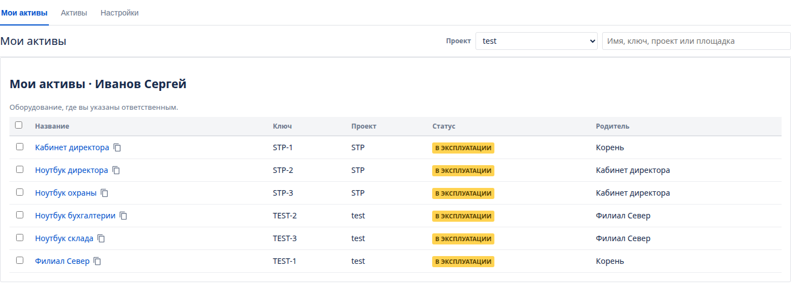
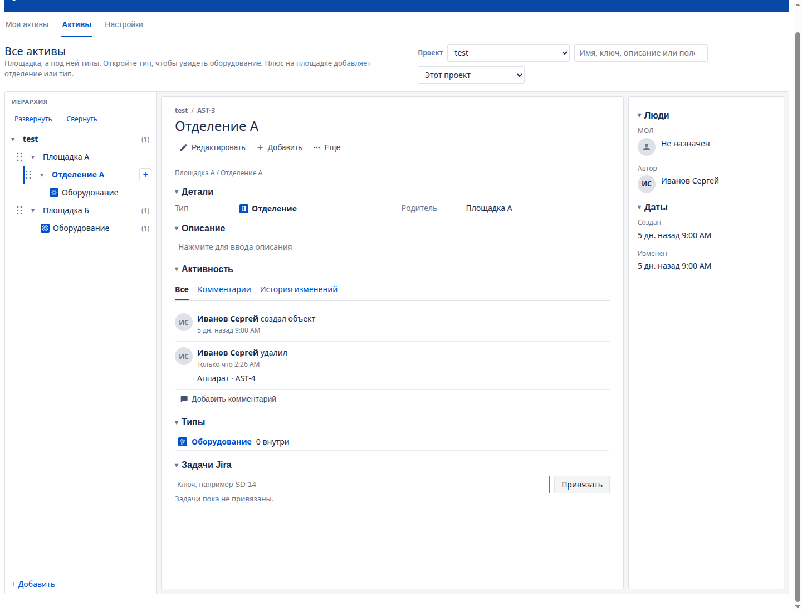
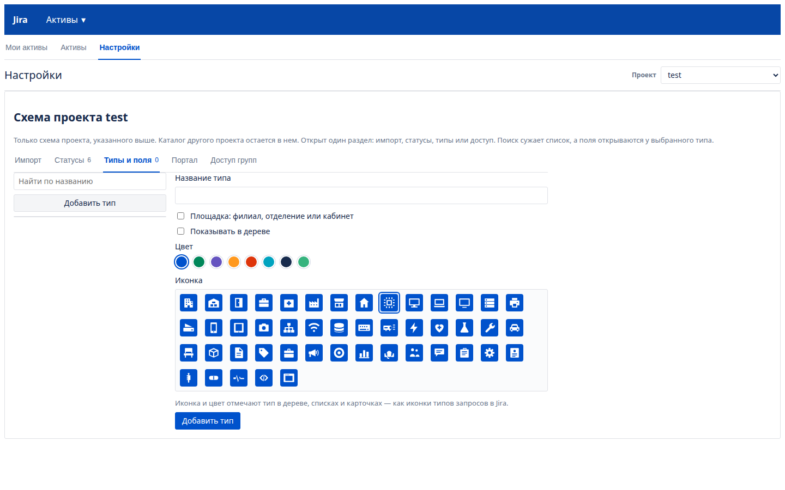

# Niout AssetHub for JSM

Дерево активов для Jira Service Management **4.21.1** (платформа Jira **8.21.1**, байткод **Java 8**). Экран встроен в страницу Jira. Готовых макетов нет: в списке только ваши проекты, типы объектов и активы вы создаёте сами. Чужой проект в дереве не появляется.

Поддержка: [niouti@yandex.ru](mailto:niouti@yandex.ru), [nioutistudio@gmail.com](mailto:nioutistudio@gmail.com).

## Скриншоты









Данные лежат в базе Jira через Active Objects. Отдельная база не нужна. Пользователи берутся из каталога Jira, в том числе из Active Directory.

## Как это закрывает задачу

1. **Проекты не пересекаются.** Дерево, типы, поля, статусы и доступ групп принадлежат проекту. Новый объект получает ключ своего проекта: в STP это STP-1, в другом проекте своя нумерация, поэтому ключи не совпадают. Уже выданные ключи AST- не переписываются. Экран активов виден тем, кто может просматривать проект, и группам из настроек этого проекта. Администратор Jira видит все. Клиент портала, у которого есть только создание заявок, экран не видит: на портале ему доступно поле «Актив проекта». Правка дерева — это отдельное право, не «Редактирование задач». Актив другого проекта для запроса возвращается как «не найден».
2. **Иерархия.** Корень — проект. Под площадкой видны только типы, которые туда добавили, и типы, у которых уже есть оборудование. Новый филиал не получает все типы проекта: в Усть-Лабинске может не быть неттопов. Пустой тип убирается с этой площадки. Клик по филиалу открывает его как заявку Jira без статуса: панель действий, детали, описание по клику, люди и даты. Типы и отделения внутри идут строками связанных заявок, без плашек статуса. Цифры и статусы стоят над списком **Все активы**. Клик по типу открывает всё оборудование этого типа. Плюс на площадке либо добавляет площадку внутрь, либо заводит тип. Объект создаётся плюсом на типе. В списке площадок, оборудования и типов можно отметить несколько строк: сменить статус, ответственного, перенести или удалить. На карточке площадки видна её история: кто добавил объект, перенёс его сюда или отсюда, и кто удалил. Удаление остаётся на площадке после того, как карточка объекта уже стёрта. С карточки оборудования и из списка печатается наклейка: имя, тип, место, ключ и QR. Сканирование открывает эту карточку в Jira. Строка места на карточке называется так, как назван тип площадки над объектом. У типа площадки можно задать свою подпись: филиал, отделение, кабинет или другое слово. Пустая подпись оставляет название типа.
3. **Статусы.** У каждого проекта свой список. Сразу есть шесть: на складе, в эксплуатации, в ремонте, в резерве, на обслуживании, списан. В настройках проекта их можно переименовать, добавить и удалить, если статус не используется. Цвет плашки выбирается из палитры: к выполнению, в работе, готово, синий, оранжевый, красный, фиолетовый, бирюзовый, серый, розовый, салатовый, коричневый. Галочка **В сводке** выводит статус цифрой над списком всех активов. Так в сводке появляются свои статусы, например ТО, поверка и КТС. Срок задаётся на карточке оборудования, когда у его типа включено обслуживание: дата последнего проведения и как часто его повторять. В этот день объект переходит в выбранный статус, а ответственному уходит письмо. Кнопка **Проведено** начинает следующий интервал. У типов без этой галочки блока на карточке нет.
4. **МОЛ из каталога.** В карточке выбирается пользователь Jira. Имя, почта, телефон, отдел, должность и каталог подтягиваются из профиля и атрибутов пользователя (телефон, отдел, должность — как их отдаёт AD). Пункт **Мои активы** показывает оборудование, где текущий пользователь указан ответственным: статус, проект и место в дереве. Строка поиска на этом экране сужает список по имени, ключу, проекту и площадке.
5. **Иконки типов.** У каждого типа — цвет и иконка в стиле Jira: цветная плашка с белым знаком, как у типов запросов на портале. Набор иконок: здание, склад, отделение, офис, больница, компьютер, сервер, принтер, медицина, шприц, пульс, проект, маркетинг, сервис, учёт, техника и программа. Иконка выбирается при создании типа и меняется в окне **Типы** или в настройках; она видна в дереве, в списках, в карточке и в сводке. Новые типы и правки схемы появляются на экране сразу, без перезагрузки страницы.
6. **Свои поля у типа.** Поля задаются у типа площадки и у типа оборудования: при создании площадки, в окне **Типы** и в настройках. У филиала можно держать адрес и ответственного, у ноутбука — модель, RAM и ROM, у аппарата УЗИ — модель, серийный номер и производителя. Поля бывают текстом, многострочным текстом, числом, датой, пользователем, выпадающим списком, флажками, переключателями, метками, ссылкой и версией. Дата подходит для ввода в эксплуатацию: на карточке она показывается как ДД.ММ.ГГГГ, в файл уходит и из файла читается и так, и как ГГГГ-ММ-ДД. Обязательное поле пустым не сохраняется. В настройках открыт один раздел: статусы, типы, импорт или доступ. Поиск сужает список. Поля видны только у типа, который выбран слева. Раздел **Импорт** скачивает оборудование книгой Excel и загружает её обратно: пустой ключ создаёт объект, заполненный ключ обновляет его. Прежний CSV тоже принимается.
7. **Сводка.** На экране **Все активы**, над списком корня проекта, стоят цифры: сколько единиц, площадок, затем статусы с галочкой **В сводке** (сразу это ремонт, обслуживание и списание) и сколько без ответственного. Рядом кольцо статусов, типы, площадки с наибольшим числом объектов и ответственные. Клик по цифре или строке отбирает этот же список, клик по площадке открывает её. Отдельного пункта меню нет: старая ссылка `view=dashboard` открывает **Все активы**. Статусы и типы считаются только по оборудованию. Список **Мои активы** каждый раз читается заново, когда раздел открывают, и обновляется после создания, правки и удаления.
8. **Заявки.** На портале поле **Актив проекта** идёт по дереву: филиал, отделение, оборудование. Можно остановиться на любом уровне. В настройках проекта, вкладка **Портал**, правило говорит: если в поле заявки выбран пункт, поле актива открывается на этой площадке. Правило из двух полей важнее одного: площадка А и отделение А открывают отделение, а не всю площадку. Пока поля не выбраны, список активов не показывается. Когда правило совпало, поле на портале клиента становится выпадающим списком активов этой площадки или этого отделения. Service Desk сам рисует это поле обычной строкой, поэтому список подставляется на странице создания заявки. Значение пишет связь заявки с активом того же проекта. На карточке заявки панель **Активы** ищет и привязывает ещё оборудование — тоже только своего проекта. Так видно, например, по какой заявке принтер списан.

## Сборка

Нужен JDK 8 и Maven 3.6+. На более новой JDK плагин соберётся, только если байткод останется 1.8: Jira 8.21 класс новее не загрузит.

```bash
export JAVA_HOME=/usr/lib/jvm/java-8-openjdk-amd64
mvn -B package
```

Готовый файл: `target/asset-tree-1.2.83.jar`.

```bash
mvn -B test
```

## Установка

Если Niout AssetHub уже включён, загрузите новый jar поверх: это обновление. Если в списке лежит отключённое приложение, удалите его и загрузите jar заново. Обновление поверх приложения, которое не запустилось, оставляет старую ошибку.

1. **Администрирование → Приложения → Управление приложениями → Загрузить приложение** и выберите jar.
2. Разведите доступ, как в разделе ниже. Пункт **Активы** виден тем, кто может просматривать проект, и группам с правом просмотра. **Настройки** — тем, у кого есть виды «Типы», «Активы» или «Администратор».
3. Пункт **Активы** в верхней навигации открывает меню: **Мои активы**, **Все активы**, **Настройки**. Те же разделы продублированы вкладками над страницей: **Мои активы**, **Активы**, **Настройки**. Вкладка **Настройки** видна тем же людям, что и пункт меню. Сводка — цифры, статусы и типы — стоит в шапке списка **Все активы**. Поиск стоит на этом же экране: строка ищет по имени, ключу, описанию и полям в выбранном проекте или во всех видимых. Рядом список сортируется по полю, а правила можно сохранить как свой фильтр. В боковом меню проекта ссылка открывает активы этого проекта: `/plugins/servlet/asset-tree?project=KEY&view=all`.
4. Для портала: **Администрирование → Задачи → Настраиваемые поля → Добавить**, тип **Актив проекта**. Повесьте поле на нужный тип запроса Service Desk и на экран. Медицине — на тип заявки портала. ИТ может не выводить его на портал и пользоваться только панелью на карточке. Чтобы выбор открывался с нужной площадки, в **Активы → Настройки → Портал** добавьте правило: имя поля на форме, текст пункта и место в дереве.
5. Клиент портала остаётся в роли Service Desk Customers: создание заявок есть, просмотра проекта нет. Тогда каскад на портале работает, а экран активов не открывается.

## Роли

Площадка — это филиал, отделение или кабинет. Тип — вид объекта. Объект — само оборудование. Чужой проект не появляется, кроме роли «Администратор».

В **Активы → Настройки → Доступ групп** группе выдают один или несколько видов:

| Вид | Что можно |
| --- | --- |
| Просмотр | Смотреть дерево, типы, объекты и сводку |
| Площадки | Добавлять, менять и удалять площадки: филиал, отделение, кабинет |
| Типы | Добавлять, менять и удалять типы объектов |
| Объект | Добавлять, менять и удалять объекты, статус, поля и переносить их |
| Активы | Полный доступ к активам своего проекта: площадки, типы, объекты и список доступа этого проекта |
| Администратор | Полный доступ ко всему и во всех проектах. Этот вид может выдать только администратор |

Просмотр входит в любой другой вид. «Активы» включает просмотр, площадки, типы и объекты. «Администратор» включает всё это во всех проектах.

| Кто в Jira | Какой это вид |
| --- | --- |
| Администраторы Jira | Администратор: все проекты |
| Руководитель проекта, роль **Administrators** | Активы этого проекта |
| Право проекта **Изменение активов** | Активы этого проекта |
| Группа только с просмотром проекта, без отдельного вида | Просмотр |
| Пользователи портала, роль **Service Desk Customers** | Только поле «Актив проекта» на портале |

Право **Изменение активов** лежит в схеме прав: **Администрирование → Задачи → Схемы прав**. Выдайте его роли проекта, а не всем сотрудникам. Глобальное право **Управление активами** даёт вид «Активы» в тех проектах, которые человек и так открывает.

Язык экрана совпадает с языком пользователя Jira: русский или английский.

## Как вести дерево

1. Плюс у проекта добавляет филиал. Назовите тип площадки и сам филиал, поля — адрес и ответственный.
2. Плюс на филиале: **Тип оборудования** — Ноутбук, Принтер, Монитор или УЗИ, у каждого свои поля. Тип сразу появляется под филиалом. **Площадка внутри** — отделение или кабинет; типы переезжают под него.
3. Клик по типу показывает оборудование. Плюс на типе добавляет объект: планшет Samsung или УЗИ GE, статус «В эксплуатации», МОЛ. У строки оборудования есть копирование. Отмеченные строки копируются вместе: кнопка **Копировать** стоит в той же панели, что статус, печать и удаление.
4. Карточка оборудования собрана как заявка Jira: панель действий, детали, описание по клику, вложения и активность. Статус — цветная плашка, как в заявке, и меняется с неё. МОЛ меняется в блоке «Люди». Выпадающий список, флажки, переключатели, метки, ссылка и версия тоже меняются прямо в карточке: клик по значению, выбор сохраняется сразу, метка, ссылка и версия — по Enter или когда поле теряет фокус. Кнопка **Копировать** создаёт такой же объект рядом: тот же тип, место, статус, описание, ответственный и поля, новый ключ и имя с пометкой «копия». Файлы и заявки остаются у исходного объекта. Комментарий выглядит как в активности заявки. Файл, в том числе PDF, кладётся в зону вложений или выбирается через «обзор». В активности видны комментарии и история: кто создал объект, сменил статус, МОЛ, поле или файл. У площадки слева постоянная метка из точек. Тяните за неё: верхняя треть строки — перед узлом, нижняя — после, середина — внутрь.
5. В блоке задач укажите ключ заявки того же проекта, например `SD-14`.

Удаление узла с потомками спрашивает подтверждение и снимает ветку, поля и связи.

## REST

Базовый путь: `/rest/asset-tree/1.0`. Нужна сессия Jira и заголовок `X-Atlassian-Token: no-check`.

| Метод | Путь | Назначение |
| --- | --- | --- |
| GET | `/meta` | Проекты, право на запись, ключ текущего пользователя, строки интерфейса |
| GET | `/assets?projectKey=IT` | Дерево, типы и статусы проекта. `q` — до 30 совпадений |
| POST | `/assets` | Создать узел (`projectKey`, `custodianKey`, поля) |
| GET | `/assets/{id}` | Карточка |
| PUT | `/assets/{id}` | Изменить карточку и значения полей |
| POST | `/assets/{id}/move` | `{"parentId": 1, "index": 0}` |
| DELETE | `/assets/{id}?cascade=true` | Удалить узел или ветку |
| POST | `/types` | Свой тип: `label`, `projectKey`, `location`, `color`, `icon`, `showInTree`. Без `icon` площадка получает `building`, оборудование — `device` |
| PUT | `/types/{typeKey}` | Частичное обновление: `{"showInTree": false}` — не разворачивать объекты этого типа в меню; `{"icon": "printer"}` и `{"color": "#DE350B"}` — внешний вид. Незаданные поля не трогаются |
| DELETE | `/types/{typeKey}` | Удалить неиспользуемый свой тип |
| POST | `/types/{typeKey}/fields` | Поле: `label`, `kind`, `required` |
| DELETE | `/types/{typeKey}/fields/{fieldKey}` | Удалить поле |
| GET | `/projects/{key}/statuses` | Статусы проекта |
| POST | `/projects/{key}/statuses` | Добавить статус: `label`, `category` (`todo`, `progress`, `done`, `blue`, `orange`, `red`, `purple`, `teal`, `gray`, `pink`, `lime`, `brown`) |
| PUT | `/projects/{key}/statuses/{statusKey}` | Переименовать статус или сменить категорию |
| DELETE | `/projects/{key}/statuses/{statusKey}` | Удалить неиспользуемый статус. Последний остаётся |
| GET | `/projects/{key}/grants` | Группы и набор `caps`: `view`, `create`, `edit`, `move`, `remove`, `comment`, `schema`, `access`. Поле `level` — сводка `view`, `edit` или `manage` |
| POST | `/projects/{key}/grants` | Выдать группе набор: `groupName` и `caps`. Старый `level` тоже принимается |
| DELETE | `/projects/{key}/grants?group=` | Снять доступ группы |
| GET | `/groups?q=` | Поиск группы Jira, до 15 |
| GET | `/projects/{key}/report` | Отчёт проекта |
| GET | `/projects/{key}/picker` | Дерево для каскада на портале |
| GET | `/users?q=` | Поиск пользователя, от двух символов |
| GET | `/users/{userKey}/assets` | Что числится на пользователе |
| GET | `/issues/{id}/context` | Проект заявки |
| GET | `/issues/{id}/search?q=` | Поиск активов этого проекта |
| GET | `/issues/{id}/assets` | Связанные активы |
| POST | `/issues/{id}/assets` | `{"assetId": 1}` |
| POST | `/assets/{id}/issues` | `{"issueKey": "SD-14"}` |
| DELETE | `/assets/{id}/issues/{issueId}` | Снять связь |

## Предпросмотр без Jira

Рядом лежит сервер с тем же экраном и тем же REST. Это не плагин и не список ваших проектов: без Jira список пуст. В установленном плагине в списке те проекты, которые пользователь может открыть.

```bash
python3 preview/server.py
```

- [Экран активов](http://127.0.0.1:47121)
- [Панель на заявке](http://127.0.0.1:47121/issue)
- [Поле портала](http://127.0.0.1:47121/portal)

Язык берётся из `Accept-Language`: с `en` — английский, иначе русский.

## Совместимость

Собрано против API Jira 8.21.1 и Active Objects 3.5.1. Плагин не зависит от API Service Desk, поэтому встаёт и на Jira Software/Core 8.21.1 той же сборки. Для Data Center в манифесте указан статус `compatible`.
